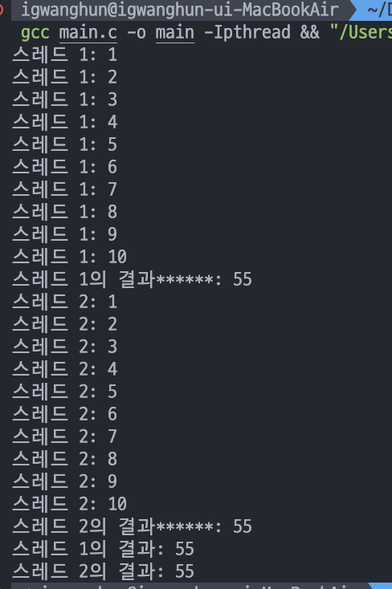
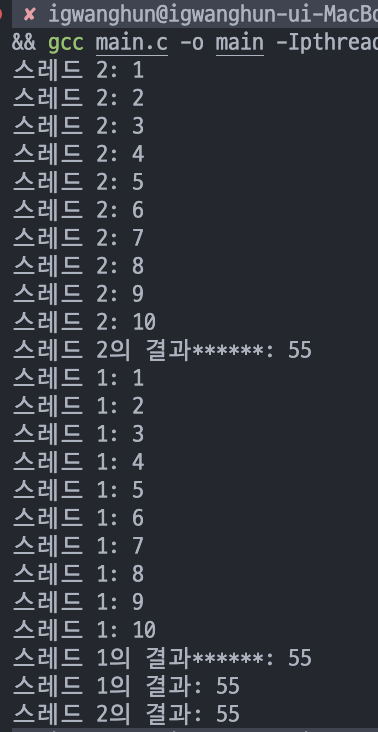

# DAY 01 

```c
#include <stdio.h>
#include <stdlib.h>
#include <pthread.h>
#include <unistd.h>

void *thread_function2(void *arg) {
    int *input = (int *)arg;
    int result = 0;

    for (int i = 1; i <= *input; i++) {
        printf("스레드 2: %d\n", i);
        result += i;
    }

    return (void *)(intptr_t)result;
}

void *thread_function1(void *arg) {
    int *input = (int *)arg;
    int result = 0;


    for (int i = 1; i <= *input; i++) {
        printf("스레드 1: %d\n", i);
        result += i;
    }

    return (void *)(intptr_t)result;
}

int main(void){
    
    pthread_t thread1 , thread2, thread3;
    
    int pid1 , pid2, pid3;
    int num1 = 5;
    int num2 = 10;
    int num3 = 15;
    void* result1 = 0, *result2 = 0, *result3 = 0;

    pthread_create(&thread1  , NULL , &thread_function1 , &num1);
    pthread_create(&thread2  , NULL , &thread_function2 , &num2);

    pthread_join(thread1, (void **)&result1);
    pthread_join(thread2, (void **)&result2);
    
    printf("스레드 1의 결과: %d\n", (int)(intptr_t)result1);
    printf("스레드 2의 결과: %d\n", (int)(intptr_t)result2);

    return 1;
}
```

### 위 코드를 실행하면, 종종 다른 결과가 나온다. 

#### 결과1
  

#### 결과2
  

- 위의 사진에서는 스레드1 의 실행이 먼저 되었고, 아래 사진에서는 스레드 2가 먼저 실행되었다. 스레드의 실행은 개발자가 예측할 수는 없고 운영체제가 이를 관리하기 때문에 실행할 때 마다 결과가 다르게 나올 수 있다.