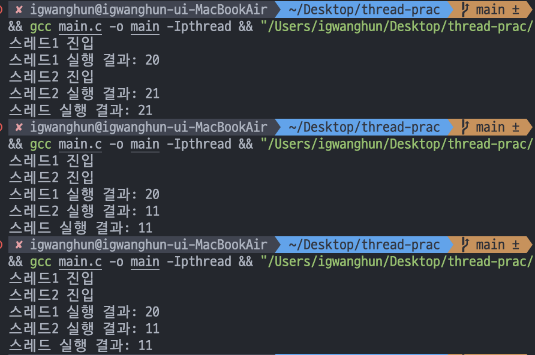
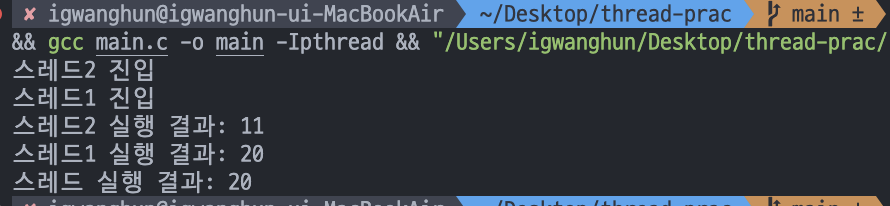

# DAY 02

### 멀티 스레드를 사용했을 때, 공유 자원에 접근할 때, 매번 결과가 다르게 나올 수 있다는 점을 테스트해보자.

```c
#include <stdio.h>
#include <stdlib.h>
#include <pthread.h>
#include <unistd.h>

int global_var = 10;
int access = 0;

void *thread_function2(void *num) {
    while(true){
        if(access == 0);
        else{
            global_var += 1;
            printf("스레드2 실행 결과: %d\n", global_var);
            access = 1;
            pthread_exit(NULL);
        }
    }
}

void *thread_function1(void *num) {
    while(true){
        if(access == 0);
        else{
            printf("스레드1 진입")
            global_var *= 2;
            printf("스레드1 실행 결과: %d\n", global_var);
            access = 1;
            pthread_exit(NULL);
        }
    }
}

int main(void){
    
    pthread_t thread1 , thread2;

    pthread_create(&thread1  , NULL , thread_function1 , NULL);
    pthread_create(&thread2  , NULL , thread_function2 , NULL);

    pthread_join(thread1, NULL);
    pthread_join(thread2, NULL);
    
    printf("스레드 실행 결과: %d\n", global_var);

    return 1;
}
```

- 현재 공유 자원 global_var 에 대하여 스레드1 과 스레드2 가 각각 다른 작업을 수행한다. 스레드 1 에서는 공유 자원에 대해서 *2 연산, 스레드2 는 공유자원에 대해서 +1 연산을 진행하는 상황

### 실행 결과





- 여러가지 결과가 나왔다. 최종 결과가 21 인 상황, 11 인 상황 , 20인 상황. OS 시간에 배웠던 것 처럼 하나의 스레드가 작업을 수행하던 도중 다른 스레드로 CPU 할당이 넘어가서 이런 결과가 나올 수 있다는 것을 확인했다. (Race condition)

- CPU 할당이 중간에 다른 스레드로 넘어간것은 2번째 실행 예시를 보자. 맨 처음에 "스레드 1 진입" 로그가 나오고 해당 스레드가 계속 실행된다고 가정하면 "스레드 1 실행결과" 로그가 그 다음에 나와야 한다. 하지만 그 바로 다음 로그는 "스레드2 진입" 인 것을 볼 수 있다. CPU 할당이 스레드2 로 넘어가서 해당 결과가 나왔다.

- 그리고 스레드 실행 순서도 실행마다 달라질 수 있는것을 확인했다. 마지막 실행 예시를 보면 스레드2 진입이 가장 먼저 로그에 남겨졌고 그 다음 스레드 1 진입이 나왔다. 하지만 다른 예시들은 스레드 1 진입이 먼저 로그로 남아있다.

### <span style="color:pink"> 여기서 의문이 들었다. OS 시간에 배웠던 것 처럼 이렇게 동일한 자원에 접근하는 경우, 동기화가 필요하다. 그러면 어쨌든 순서대로 해당 작업을 실행해야 하는데 이러면 그냥 하나의 스레드로 순차적으로 실행하는것과 차이점이 무엇인가? 서로 다른 자원을 다루는 상황에서는 멀티스레드 작업을 통해 성능을 향상시키면 좋지만 같은 자원에 대해 작업하는 경우 굳이 멀티스레드 작업을 해야하나? 

#### 지금 드는 생각으로는 이 멀티스레드의 목적 자체가 "순차적" 이라는 개념 보다는 "성능의 개선" 을 달성하려는 과정이고 그 과정에서 어쩔 수 없이 공유자원에 대한 접근이 동시에 일어날 수 밖에 없는 상황이 생길 수 있다고 생각이 들었다. 내가 예시로 든 "순차적" 개념에 빠져있었던 것 같다.