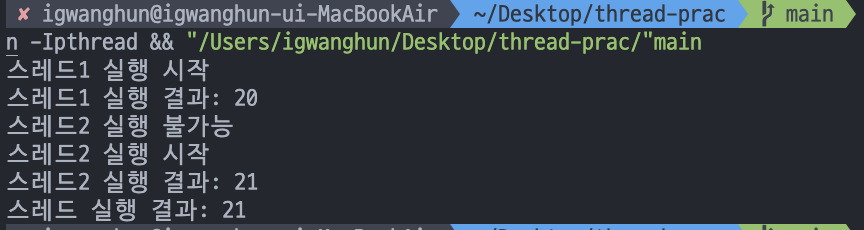

# DAY 03

### Entry section 에 입장조건을 걸어 공유 자원을 한번에 하나의 스레드만 점유할 수 있도록 한다.

#### 1. accessAble 접근 변수 이용

```C
int accessAble = 1;

void *thread_function1(void *num) {

    while(1){
        if(accessAble == 0) {
            printf("스레드1 실행 불가능\n");
            continue;
        }
        else{
            accessAble = 0;                 // entry section
            printf("스레드1 실행 시작\n");
            global_var *= 2;                // critical section
            printf("스레드1 실행 결과: %d\n", global_var);
            accessAble = 1;                // exit section  
            pthread_exit(NULL);
        }
    }
}
```

- accessAble 변수가 0 이면 global_var 변수에 접근할 수 없게 만든다.
- <span style="color:pink"> 만약 Critical section 안에서 CPU 가 넘어가면 race condition 이 일어난다. CPU 가 넘어가는것을 방지할 수 는 없지만 다른 스레드에서 global_var 변수에 접근을 막기 위해 다음을 이용
```C
if(accessAble == 0) {
    printf("스레드1 실행 불가능\n");
    continue;
}
```

```C
else{
    accessAble = 0;                 // entry section
    printf("스레드1 실행 시작\n");
    global_var *= 2;                // critical section
    printf("스레드1 실행 결과: %d\n", global_var);
    accessAble = 1;                // exit section  
    pthread_exit(NULL);
}
```

- printf("스레드1 실행 시작\n"); 실행 이후 cpu 가 넘어갔다고 가정해보자. 만약 cpu 가 스레드2 로 넘어가도 이미 accessAble = 0 인 상태이기 때문에 while 문 안을 계속 돌게된다. 



- 스레드 1을 실행중이었다가 스레드 2로 넘어가서 "스레드 2 실행 불가능" 로그가 찍힌것을 볼 수 있다.

- 하지만 여기서 CPU 가 넘어갈 때 까지 계속 while 문에서 busy waiting (spinlock) 이 있기 때문에 다른 작업을 수행하지 못해서 자원 낭비가 된다.
