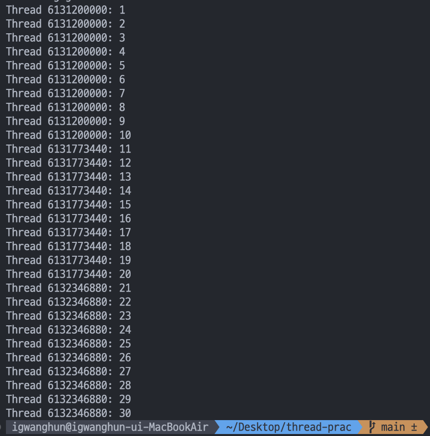
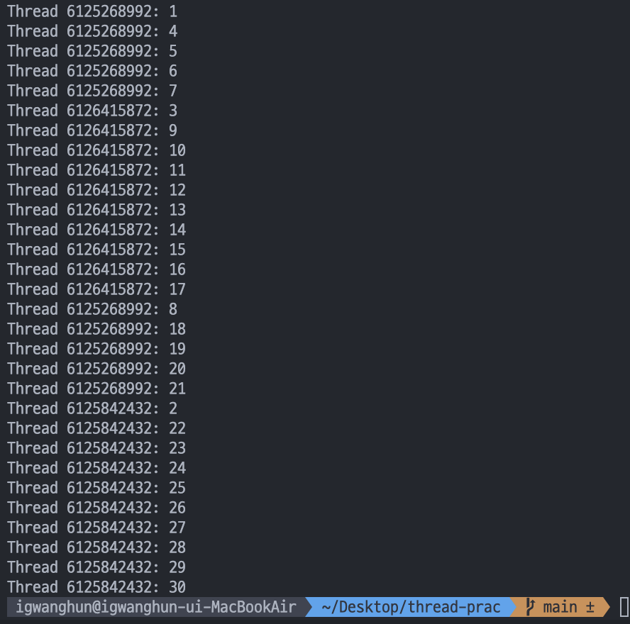

# Day 06

### Mutex 로 lock 구현

```C
int num = 0;
pthread_mutex_t mutex;

void* thread_function(void* arg){
    
    pthread_t* thread = (pthread_t*) arg;

    for(int i = 0; i < 10; i++){
        pthread_mutex_lock(&mutex);

        num++;
        printf("Thread %lu: %d\n", (unsigned long)*thread, num);

        pthread_mutex_unlock(&mutex);
    }
}

int main(void){

    pthread_t thread1 , thread2 , thread3;
    pthread_mutex_init(&mutex, NULL);

    pthread_create(&thread1, NULL, thread_function, &thread1);
    pthread_create(&thread2, NULL, thread_function, &thread2);
    pthread_create(&thread3, NULL, thread_function, &thread3);

    pthread_join(thread1, NULL);
    pthread_join(thread2, NULL);
    pthread_join(thread3, NULL);
    
    pthread_mutex_destroy(&mutex);

    return 0;
}
```

- 어제에 이어 작업을 해 봤는데 큐에 있는 스레드를 지정해서 실행시킬 수 없었다. 그래서 해당 작업은 포기하고 랜덤한 스레드가 실행되는 부분만 직접 보기로 해서 mutex 를 이용해 해당 코드를 구현해봄

```C
pthread_mutex_t mutex;
// mutex 변수 선언

pthread_mutex_init(&mutex, NULL);
// 인자의 변수를 mutex 변수로 사용하겠다

pthread_mutex_lock(&mutex);
// 해당 mutex 변수에 lock 을 건다. lock 이 걸려 있으면 다른 스레드에서 접근 할 수 없다. (다른 스레드는 대기함)

pthread_mutex_unlock(&mutex);
// mutex 변수를 unlock 한다. unlock 하면 다른 스레드가 접근 할 수 있음.

```

- 아래는 실행 결과



- 여기서 pthread_mutex_lock 과 pthread_mutex_unlock 을 제거하고 실행해보았다.



#### <span style="color:pink">원래 예상으로는 스레드는 뒤죽박죽이되 1,2,3...30 까지 숫자는 오름차순으로 나오는 것을 예상하고 있었다. 그런데 생각과 달리 숫자가 뒤죽박죽인것을 보고 이상해서 왜 그런지 생각해보았다. </span>

#### <span style="color:skyblue"> 예상: 스레드끼리 콜 스택을 공유하지 않기 때문에 num++ 된 이후 printf 작업이 콜 스택에 남은 상태에서 CPU 가 다른 스레드로 넘어가고 해당 스레드를 처리한 후 CPU 가 되돌아오면 그때 printf 가 되서 지연처리된다. 이전에 printf 처리되지 않은 printf 가 cpu를 받은 후 처리되고 다시 increment 작업을 하기 때문에 해당 결과가 나왔다.</span>
 
